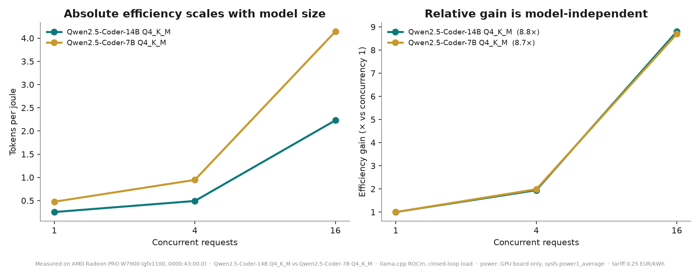
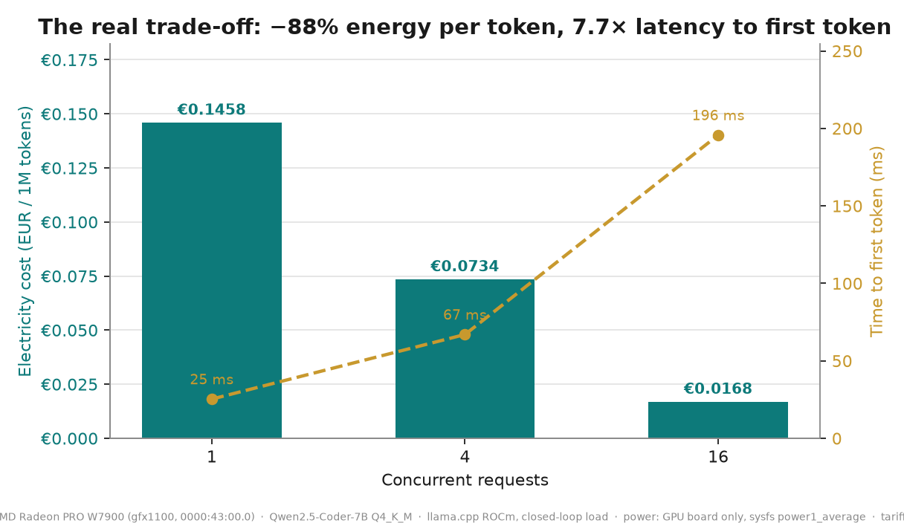

# costbench

**On-prem tokens are not free. They cost watts. We measured how many.**

An on-premises LLM agent with a cost-governance gateway, where every euro
reported comes from a **tokens-per-joule curve measured on this hardware** —
not from a price list, not from a model.

`AMD AI DevMaster · Track 2: Agentic AI` · `AMD Radeon PRO W7900 (gfx1100)` ·
`ROCm 7.2.1 · llama.cpp HIP` · `egress: on-prem only`

Every number below is tagged **measured** and reproducible from
[`proofs/`](proofs/). One measurement was rejected as invalid and is kept,
with its post-mortem, in [`rejected/`](rejected/).

---

## Two findings

### 1. Batching buys 8.7× energy efficiency — and the factor does not depend on the model

| Model | conc 1 → 16 | tokens/joule gain |
|:--|---:|---:|
| Qwen2.5-Coder-7B Q4_K_M | 0.476 → 4.142 | **8.70×** |
| Qwen2.5-Coder-14B Q4_K_M | 0.253 → 2.229 | **8.80×** |

Two models, one twice the size of the other, produce the same relative gain
to within 1%. Normalise each curve by its own concurrency-1 value and they
lie on top of each other.



### 2. Absolute efficiency scales inversely with model size

| concurrency | 7B tok/J | 14B tok/J | ratio |
|---:|---:|---:|---:|
| 1 | 0.476 | 0.253 | 0.53 |
| 4 | 0.946 | 0.492 | 0.52 |
| 16 | 4.142 | 2.229 | 0.54 |

Double the weights, roughly half the efficiency, at every concurrency level.
This is the signature of a **memory-bandwidth-bound decode**: each token
re-reads the full weight set from GDDR6, so doubling the weights halves the
tokens you get per joule.

### And power is not monotonic in batch size

| concurrency | 7B power | 14B power |
|---:|---:|---:|
| 1 | 216.5 W | 226.1 W |
| 4 | **229.0 W** | **236.9 W** |
| 16 | 168.1 W | 184.7 W |

Both models peak at concurrency 4 and then draw **less** power at
concurrency 16 while doing ~6.8× the work. Reproduced across models, across
four independent sessions, with achieved concurrency verified per run.

---

## The honest trade-off

Energy is not free money. It is bought with latency.

| | 7B | 14B |
|:--|---:|---:|
| Energy cost per 1M tokens | €0.1458 → €0.0168 (**−88.5%**) | €0.2741 → €0.0312 (**−88.6%**) |
| Time to first token (p50) | 25 ms → 196 ms (**7.8×**) | 56 ms → 571 ms (**10.2×**) |



Scheduling that trade-off is exactly the job of a cost-governance layer,
which is the second half of this project.

---

## Full results

| Model | Conc | Achieved | Throughput (tok/s) | Power (W) | Tokens/J | TTFT p50 (ms) | EUR/1M tokens |
|:--|---:|---:|---:|---:|---:|---:|---:|
| Qwen2.5-Coder-14B Q4_K_M | 1 | 1 | 57.3 | 226.1 | 0.253 | 56 | 0.2741 |
| Qwen2.5-Coder-14B Q4_K_M | 4 | 4 | 116.6 | 236.9 | 0.492 | 170 | 0.1410 |
| Qwen2.5-Coder-14B Q4_K_M | 16 | 16 | 411.6 | 184.7 | 2.229 | 571 | 0.0312 |
| Qwen2.5-Coder-7B Q4_K_M | 1 | 1 | 103.1 | 216.5 | 0.476 | 25 | 0.1458 |
| Qwen2.5-Coder-7B Q4_K_M | 4 | 4 | 216.6 | 229.0 | 0.946 | 67 | 0.0734 |
| Qwen2.5-Coder-7B Q4_K_M | 16 | 16 | 696.3 | 168.1 | 4.142 | 196 | 0.0168 |

All values `measured`. GPU **board** power only (sysfs `power1_average`,
PCI bus `0000:43:00.0`); excludes CPU, RAM, cooling and datacenter PUE.
Tariff assumed 0.25 EUR/kWh — the only modeled input, and it is a
multiplier: change it and every euro figure scales linearly.

---

## How the measurement is made honest

Four things had to be fixed before the numbers meant anything. Each failure
is documented because each one silently produced plausible-looking data.

**The power sensor lags ~18 seconds.** `power1_average` is a long-window
moving average. Runs of 2–5 seconds finished before the sensor reacted, and
reported 14 W under full load. Fix: sustained 90-second runs, first 25
seconds of samples discarded.

**The host has 8 GPUs; sysfs exposes all of them.** Taking the first
readable hwmon path meant measuring somebody else's card. Fix: resolve the
assigned GPU by PCI bus via `rocm-smi --showbus`, then read only that card's
hwmon. The resolved bus and paths are recorded in every result file.

**Wave-barrier load generation deflates power at high batch.** Firing N
requests and waiting for all of them leaves the GPU partly idle during the
straggler tail, and the tail grows with N. Fix: closed-loop load keeping
exactly N requests in flight, with the achieved concurrency measured and
recorded (`achieved_concurrency`) as a validity check.

**A stale server on the port makes you measure the wrong model.** A liveness
check answered by a leftover process caused a "14B" benchmark that actually
re-measured the 7B — caught because throughput matched the 7B to one decimal
place. Fix: free the port, then verify the *served model name*, not just that
something answers. See [`rejected/README.md`](rejected/README.md).

---

## The gateway

`gateway.py` sits in front of any OpenAI-compatible server and does three
things.

**Meters real energy.** Every response carries the measured cost:

```json
"x_cost": {
  "tokens": 512,
  "concurrency_at_request": 4,
  "tokens_per_joule_measured": 0.946,
  "energy_joules": 541.2,
  "cost_eur": 0.00003758,
  "basis": "GPU board power only; excludes CPU, RAM, cooling, PUE",
  "cost_model_source": "costbench_qwen7b-q4km-v3-closedloop_...json"
}
```

`cost_model_source` is the point: every euro traces back to a measurement
file in this repository. And because the cost depends on the concurrency at
the moment of the request, the *same* request costs 8.7× less when it
arrives while the GPU is already busy. That is the only honest way to meter
on-prem inference.

**Enforces privacy routing.** `X-Privacy: strict` is a constraint, not a
preference: it stays local regardless of queue depth, latency budget, or
whether an external provider is configured.

**Writes a local audit log.** SQLite, on-prem, one row per request with
route, reason, tokens, joules, euros and egress. The air-gap claim is not
written in prose — it is [`proofs/audit_export_*.json`](proofs/), where
`external_egress` is `0` across every session.

---

## The agent

`agent.py` — tool invocation, multi-step planning, filesystem confined to a
sandbox root. Actions are constrained by JSON schema, so llama.cpp converts
the schema to a GBNF grammar and the model **cannot** emit a malformed
action; the format is imposed at sampling, not requested in the prompt.

A recorded run ([`proofs/video_take_20260730T112143Z.txt`](proofs/)):

```
[step 1] 37 tok · 77.1 J · €0.00000535 · route=local egress=none
  tool: list_files(proofs/, *.txt)
[step 2] 59 tok · 122.9 J · €0.00000854 · route=local egress=none
  tool: read_file(proofs/bench14b_...txt)
[step 3] 98 tok · 204.2 J · €0.00001418 · route=local egress=none
  final answer

"The best tokens-per-joule ratio is achieved with concurrency 16 ...
 411.65 tok/s at 184.66 W, 0.0312 EUR/1M tok."

3 steps · 194 tokens · 404.2 J · EUR 0.000028 · 0 bytes left the network
```

Escaping the sandbox is denied, not merely discouraged: `../` and absolute
paths raise before any read.

---

## Limits

- **Board power only.** Real operating cost is higher: CPU, RAM, cooling and
  datacenter PUE are excluded, as is hardware amortisation.
- **The cause of the power drop is hypothesised, not proven.** Memory-bound
  decode is consistent with the 0.53× cross-model ratio, but clock probing
  could not confirm it: `mclk` sits pinned at 1124 MHz at every concurrency
  level, so clocks carry no information about memory *traffic*. Raw probe
  data in [`proofs/clockprobe_*.csv`](proofs/). Settling this needs bandwidth
  counters, not clocks.
- **Token counting approximates one streaming chunk as one token.**
- **Three concurrency levels** (1, 4, 16), single GPU, single quantisation
  (Q4_K_M).
- **The electricity tariff is assumed**, not measured.

---

## Reproduce

```bash
git clone https://github.com/Artkill24/costbench && cd costbench

# full unattended benchmark session on an AMD GPU
bash setup.sh          # builds llama.cpp with HIP, fetches the model, measures

# gateway + agent + audit export
bash demo.sh

# figures and results table from proofs/
python3 charts.py --proofs proofs/ --out charts/
```

`setup.sh` aborts in the first two minutes if power telemetry is
unavailable, rather than burning a GPU hour to produce nothing.

Environment captured in every result file: driver 6.16.13, ROCm 7.2.1,
HIP 7.2.53211, AMD Radeon PRO W7900 (VBIOS 113-D7070910-100, 241 W cap,
51.5 GB), AMD EPYC 9334 host.

---

## Files

| | |
|:--|:--|
| `costbench.py` | energy-per-token benchmark; PCI-resolved sensor, closed-loop load |
| `gateway.py` | OpenAI-compatible cost-governance gateway |
| `agent.py` | sandboxed on-prem agent with per-task energy accounting |
| `charts.py` | figures and results table from `proofs/` |
| `setup.sh` / `demo.sh` | unattended GPU sessions |
| `clockprobe.sh` | clock/power probe (hypothesis test, inconclusive) |
| `mock_upstream.py` | **fake** server for wiring tests — produces no measurements |
| `proofs/` | raw results, logs, audit exports, checksums |
| `rejected/` | invalidated measurement and post-mortem |

MIT.
